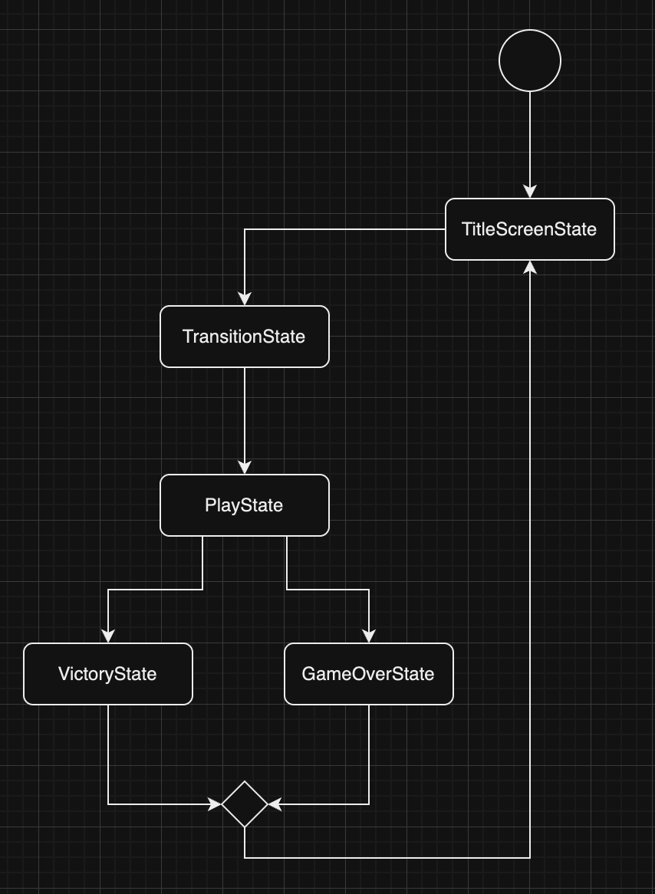
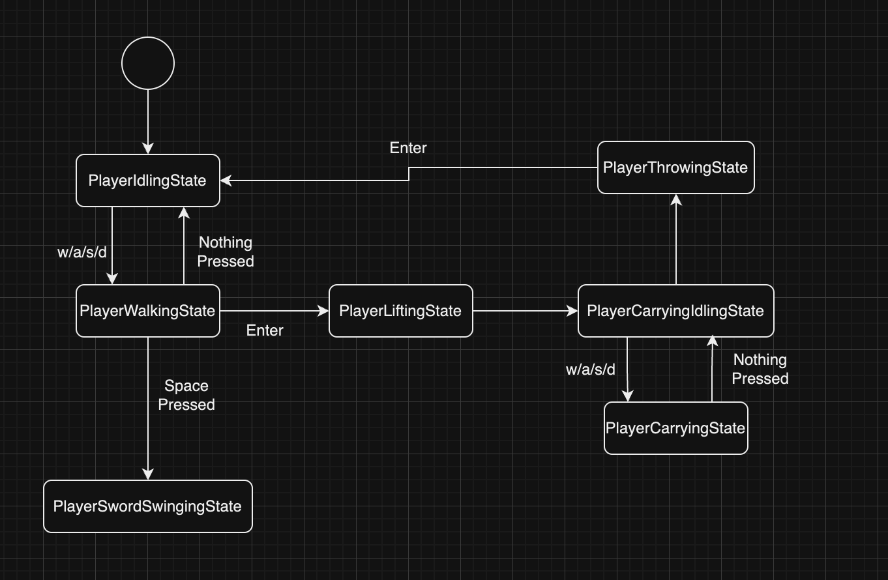
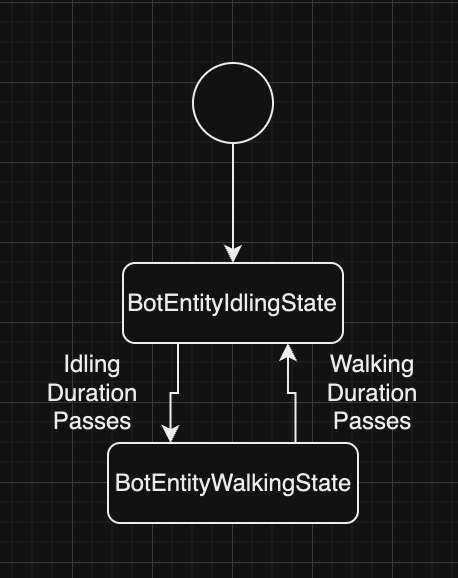
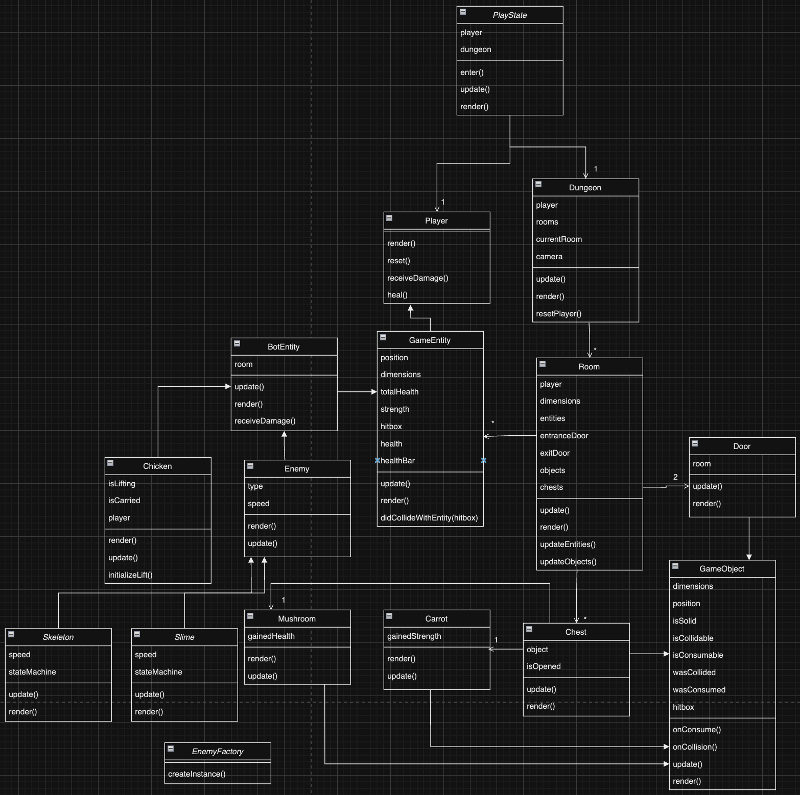
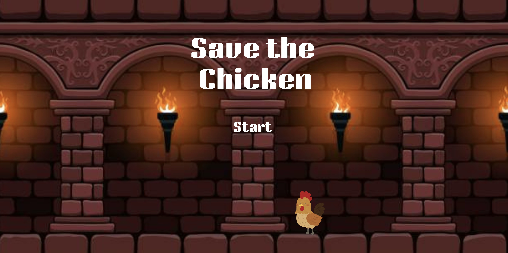

# 🐔 Save The Chicken

> **This project was developed for the Game Programming course at John Abbott College.**  
>> By [Elsana Kanybek](https://github.com/elkanybek) and [Joseph Lehman](https://github.com/joeyl83) 

## ✒️ **Description**  
In this challenging and whimsical top-down action-adventure game, the player’s goal is to navigate through 3 rooms (each representing a level) and safely escort a chicken to the end door to win. The chicken is not only an adorable companion but also vital to survival—its death results in the player’s immediate failure. Carrying the chicken adds an extra layer of difficulty, as the player is unable to use their sword to defend against enemies.

Each level is filled with obstacles like flowers, wooden structures, and houses that block the player’s path, forcing them to plan their route. Enemies such as wandering slimes and cunning skeletons create additional hazards: slimes move randomly, while skeletons actively pursue the player.  

Scattered across the map are power-ups, including mushrooms that restore health and treasure chests containing carrots that increase the player’s strength. However, when carrying the chicken, the player becomes vulnerable and must rely on timing and strategy to survive. This game combines action, strategy, and humor, challenging players to protect their feathery friend under pressure.

---

## 🕹️ **Gameplay**  
The player begins each level in a room with two doors: an entrance and an exit. Alongside the player is a chicken with three lives that moves unpredictably. The objective is to reach the exit while carrying the chicken, avoiding obstacles and enemies.  

### **Key Mechanics**  

#### 🗺️ **Navigation**  
- Maneuver through obstacles like flowers, wooden barriers, and houses to reach the goal.  
- The chicken moves randomly, adding unpredictability to the gameplay.  

#### 👾 **Enemies**  
- **Slimes**: Move randomly across the map and pose a general threat.  
- **Skeletons**: Actively track the player’s position to chase and attack.  

#### ⚔️ **Combat**  
- Players can use a sword to attack enemies when not carrying the chicken.  
- Carrying the chicken disables the player’s ability to attack, requiring stealth and evasion.  

#### 📺 **User Interface**  
- All entities have health bars with color to display how much health is remaining.

#### 🍄 **Power-ups**  
- **Mushrooms**: Found in treasure chests, boost the player’s strength to deal more damage.
- **Carrots**: Restore or increase the player’s health.

#### 🏆 **Victory/Failure Conditions**  
- **Victory**: Successfully reach the exit door while carrying the chicken.  
- **Failure**: The level ends if either the chicken or the player dies.  

---

## 📃 **Requirements**  

### **General**  
- The system shall start the player in a room with an entrance door and an exit door.  
- The system shall add a chicken with three lives near the player.  

### **Gameplay Setup**  
- The system shall place obstacles (e.g., flowers, wooden barriers, houses) on the map.  
- The system shall place slimes and skeletons on the map.  
- The system shall allow the player to pick up and drop the chicken.  
- The system shall disable the player’s ability to attack when carrying the chicken.  
- The system shall display a health bar above all entities.

### **Player Actions**  
- The player shall be able to move in four directions.  
- The player shall be able to pick up the chicken by interacting with it.  
- The player shall be able to drop the chicken at will.  
- The player shall use their sword to attack enemies when not carrying the chicken.  

### **Enemies**  
- Slimes shall move randomly across the map.  
- Skeletons shall track the player's x, y position to move closer.  
- Enemies shall deal damage to the player upon contact.  
- The player shall lose health upon taking damage, resulting in death if it reaches zero.  

### **Power-ups**  
- The system shall spawn mushrooms on the map to restore or increase health.  
- The system shall spawn a chest containing a carrot to increase the player’s strength.  

### **Obstacles**  
- Obstacles shall block player movement, requiring alternate paths.  

### **Winning and Losing**  
- The system shall progress the player to the next level upon reaching the exit door with the chicken.  
- The system shall end the game if the chicken’s lives reach zero.  
- The system shall end the game if the player’s health reaches zero.  

### **Additional Features**  
- The system shall display the player’s health, chicken lives. 

---

## 🤖 **State Diagram**  

> **Note**: Diagrams for both game states and entity states are required.  

  

  

  

---

## 🗺️ **Class Diagram**  

  

---

## 🧵 **Wireframes**  

### **Main Menu**  
  

- _Let’s Start_ the game. 

The GUI is clean and simple to keep the focus on gameplay.

---

## 🎨 **Assets**  

### **Wireframe Tools**  
We used [app.diagrams.net](https://app.diagrams.net/) for wireframes. These mockups outline the game’s design and flow.  

### **Visual Design**  
The GUI is simple and playful, drawing inspiration from classic games like *The Legend of Zelda* and *Stardew Valley*.  

### **Sprites**  
- **[Cute Fantasy RPG](https://kenmi-art.itch.io/cute-fantasy-rpg)**: Beautiful sprites for the UI.  

### **Fonts**  
- **[Roboto](https://fonts.google.com/specimen/Roboto)**: A clean, lightweight font for general UI.  
- **[Chubby Chicken Font](https://www.dafont.com)**: For playful titles and menus.

### **Sounds**  
- All sound effects were sourced from [Freesound](https://freesound.org):  
  - **Chicken cluck**: [Chicken Effect](https://freesound.org).  
  - **Enemy attack**: [Enemy Effect](https://freesound.org).  

---

## 📚 **References**  
- Design inspiration from *The Legend of Zelda* series.  
- Asset sources from [Freesound.org](https://freesound.org).  
- Development tools: Visual Studio Code.
- Programming language: JavaScript
